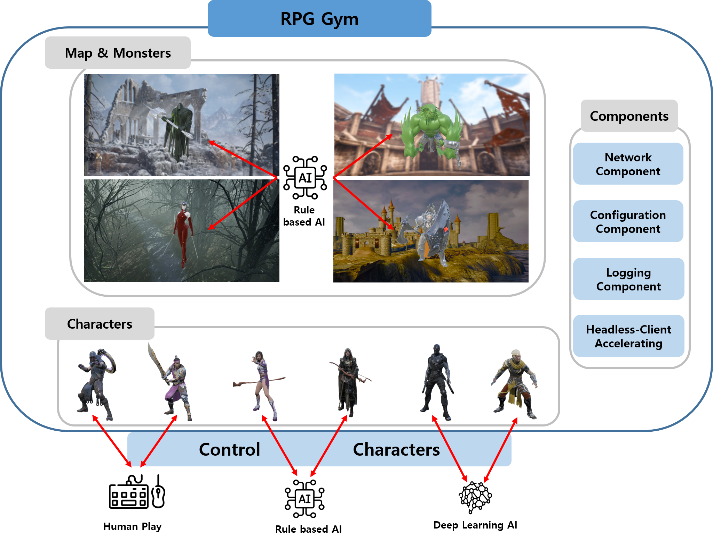

## RPGGym
RPG Gym: RPG Game Simulator for Deep Learning [[PDF]](https://github.com/Tab4Space/RPGGym/blob/main/RPG_Gym_RPG_Game_Simulator_for_Deep_Learning.pdf) 

### 프로젝트 개요
1. 프로젝트 기간: 2022. 10 ~ 2022.12
2. 개발 도구 및 개발 환경:  
       
3. 참여 인원: 1인
4. 석사 학위 논문
    * Unreal Engine 5(5.0.3), C++(10%) & Blueprint(90%) 구현
    * RPG 게임의 보스 레이드 콘텐츠 구현
    * 플레이어 캐릭터(6개), 보스 몬스터(4개), 공격 스킬(각 8개), 몬스터의 BT 인공지능 구현
    * Deep Learning 학습에 필요한 기능(Python 프로세스 통신, Headless, 가속화, 로깅, Config 파싱 등) 구현
    * Imitation Learning, Reinforcement Learning 학습 및 실험
    * 플레이어 캐릭터 & 보스 몬스터 간의 Balance 조절 실험
     
    
 

### 프로젝트 세부 내용
**1. 캐릭터 구현**
* 캐릭터는 직접 조작, BT를 사용한 조작, Deep Learning 결과에 따른 조작으로 제어할 수 있으며, JSON 파일로 설정
* 각 캐릭터에는 UDP 소켓이 구현되어 있으며, Deep Learning을 사용할 경우 UDP 패킷 메시지에 따라 데이터 송수신, 시뮬레이션 리셋, 시뮬레이션 종료를 처리
* BaseCharacter 클래스(C++)에서 공통 기능을 구현한 후 Blueprint로 상속하여 스킬, 데미지 처리 등을 구현
* 공격 스킬은 모션에 맞춰 발동되도록 Anim Montage에 AnimNotify를 추가하고 Notify에서 캐릭터의 데미지 전달 함수를 호출하도록 구현

 

**2. 캐릭터 & 보스 BT 기반 AI 구현**
* BT를 사용하여 전투 시나리오가 가능한 AI 기능 구현 (Blueprint)
* (좌) 캐릭터, (우) 몬스터

 

**3. 게임 시스템 구현**
* Game Instance 구현 (Blueprint)
    * 게임을 실행할 때, 캐릭터, 보스 몬스터, 게임 규칙 등 필요한 정보를 JSON 파일에서 파싱
    * 파싱된 데이터는 구조체로 관리
    
* Game Mode 구현 (Blueprint)
    * 게임이 시작될 때, 캐릭터, 보스 몬스터, 게임 규칙을 Game Instance에서 파싱한 JSON 데이터를 사용해 초기화
    * 게임의 제한 시간, 리셋, 종료 등을 관리
    
 

**4. 시뮬레이션 기능 구현**
* Deep Learning 학습에서 매 시뮬레이션마다 파라미터를 수정할 수 있도록 JSON 데이터 파싱 구현 (Blueprint)
* Deep Learning 프로세스와 필요한 데이터를 송수신 할 수 있도록 UDP 통신 기능 구현 (Blueprint)
* Deep Learning (Imitation Learning)에 필요한 학습 데이터(캐릭터 조작, 상태, 환경 정보 등)를 수집할 수 있는 로깅 기능 구현 (Blueprint)
* Deep Learning 학습에는 렌더링이 필요없으므로 Headless 기능 구현
* 시뮬레이션에 소요되는 물리적 시간을 단축하기 위해 가속화 기능 구현
 

### UE5 프로젝트 링크
[Google Drive](https://drive.google.com/file/d/1o-tWSa91LZL7B0JbRT2CPW2Fl-VFyi4c/view?usp=share_link)
 

### 시연 영상
[Main video (Youtube)](https://youtu.be/bcWVn1OAfio?si=WacA7I782eE65u20)
[Playlist (Youtube)](https://www.youtube.com/playlist?list=PLnRVH8DOZjpBI7xO6tHZ05E6oc1IDHXe7)